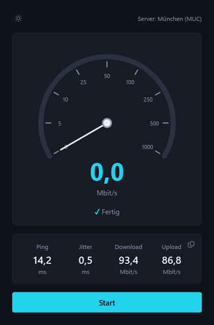

# SpeedTest

Ein Internet-Speedtest für Windows: misst Ping, Jitter, Paketverlust sowie Download- und
Upload-Geschwindigkeit — als moderne WPF-App im Windows-11-Look (Dark/Light) und als
Konsolenversion. Die Messlogik steckt in einer wiederverwendbaren .NET-Bibliothek.



## Features

- **Ping-Messung** per ICMP: Latenz, Jitter (mittlere Differenz aufeinanderfolgender
  Pings) und Paketverlust
- **Download & Upload** über parallele HTTP-Streams mit Warm-up-Phase und Live-Werten
- **Animierter Tacho** mit nichtlinearer Skala (0–1000 Mbit/s), weich zählender Zahl
  und Fortschrittsbogen
- **Abbrechen** jederzeit möglich; fertige Teilergebnisse bleiben stehen
- **Ergebnis-Historie** (letzte 50 Läufe, `%AppData%\SpeedTest\history.json`) mit
  Undo beim Löschen statt Bestätigungsdialog
- **Messserver-Info** mit Detail-Popup: Standort, eigene IP (kopierbar), Mini-Karte
  (OpenStreetMap) und Google-Maps-Link
- **Ergebnis-Export** in die Zwischenablage
- **Dark-/Light-Mode** zur Laufzeit umschaltbar, inklusive Titelleiste
- **Ehrliche Fehlanzeige**: Lehnt der Testserver Anfragen ab (Rate-Limit), zeigt die
  App „fehlgeschlagen" statt irreführender 0,0-Werte

## Projekte

| Projekt | Beschreibung |
|---|---|
| `SpeedTest.Core` | Messlogik (Klassenbibliothek, ohne UI-Abhängigkeiten) |
| `SpeedTest.Cli` | Konsolenversion mit Live-Anzeige |
| `SpeedTest.Gui` | WPF-App (net10.0-windows) |

## Bauen & Starten

Voraussetzungen: Windows, [.NET-10-SDK](https://dotnet.microsoft.com/download/dotnet/10.0)

```powershell
# GUI starten
dotnet run --project SpeedTest.Gui

# Konsolenversion starten
dotnet run --project SpeedTest.Cli
```

## Veröffentlichen (Publish)

```powershell
# Framework-abhängig (Zielrechner braucht die .NET-10-Runtime)
dotnet publish SpeedTest.Gui -c Release

# Eigenständig (bringt die Runtime mit, größere Ausgabe)
dotnet publish SpeedTest.Gui -c Release -r win-x64 --self-contained
```

Die Ausgabe liegt danach unter `SpeedTest.Gui\bin\Release\net10.0-windows\...\publish`.

## Hinweis zur Messung

Gemessen wird gegen die öffentlichen Speedtest-Endpunkte von **Cloudflare**
(`speed.cloudflare.com`). Die Ergebnisse hängen damit auch von der Anbindung an das
nächstgelegene Cloudflare-Rechenzentrum ab (die App zeigt den Standort an). Bei sehr
vielen Messungen in kurzer Zeit kann Cloudflare Anfragen vorübergehend ablehnen
(Rate-Limit) — die App zeigt die betroffene Phase dann als fehlgeschlagen an; nach
einigen Minuten funktioniert die Messung wieder.

## Lizenz

[MIT](LICENSE)
